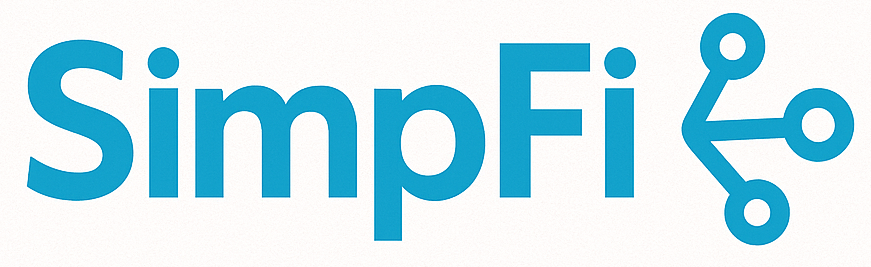

<!-- Improved compatibility of back to top link: See: https://github.com/othneildrew/Best-README-Template/pull/73 -->

<!--
*** Thanks for checking out the Best-README-Template. If you have a suggestion
*** that would make this better, please fork the repo and create a pull request
*** or simply open an issue with the tag "enhancement".
*** Don't forget to give the project a star!
*** Thanks again! Now go create something AMAZING! :D
-->

<!-- PROJECT SHIELDS -->
<!--
*** I'm using markdown "reference style" links for readability.
*** Reference links are enclosed in brackets [ ] instead of parentheses ( ).
*** See the bottom of this document for the declaration of the reference variables
*** for contributors-url, forks-url, etc. This is an optional, concise syntax you may use.
*** https://www.markdownguide.org/basic-syntax/#reference-style-links
-->

<!-- PROJECT LOGO -->
 

  

<h3 align="center">SimpFi</h3>

  

    SimpFi is a comprehensive personal finance management app built with React Native that simplifies how you track, analyze, and share your financial data. Whether you're managing personal expenses or splitting bills with friends, SimpFi provides an intuitive and powerful solution for modern financial management.
     
    <a href="https://github.com/github_username/repo_name">View Demo</a>
  

<!-- ABOUT THE PROJECT -->
## About The Project
|                                                                Summary                                                                 |                                                                Personal                                                                 |
| :------------------------------------------------------------------------------------------------------------------------------------: | :-------------------------------------------------------------------------------------------------------------------------------------: |
|  |  |

|                                                                                                                                                                                                                  Group                                                                                                                                                                                                                  |
| :-------------------------------------------------------------------------------------------------------------------------------------------------------------------------------------------------------------------------------------------------------------------------------------------------------------------------------------------------------------------------------------------------------------------------------------: |
|    |

|                                                                                                                                                                                                                   Analyze Overview                                                                                                                                                                                                                   |
| :--------------------------------------------------------------------------------------------------------------------------------------------------------------------------------------------------------------------------------------------------------------------------------------------------------------------------------------------------------------------------------------------------------------------------------------------------: |
|    |

|                                                                                                                                               Analyze Detail                                                                                                                                               |
| :--------------------------------------------------------------------------------------------------------------------------------------------------------------------------------------------------------------------------------------------------------------------------------------------------------: |
|   |

### Key Features
**📊 Summary Dashboard**
Get a quick overview of your financial health with real-time insights into your income, expenses, and balance trends.

**👤 Personal Finance Management**
- Track individual income and expenses
- Categorize transactions for better organization
- Monitor spending patterns and financial goals

**👥 Group Expense Sharing**
- Create groups for shared expenses with friends, family, or roommates
- Split bills fairly and track who owes what
- Seamless transaction management within groups
- Real-time updates on group balances and settlements

**📈 Advanced Analytics**
- Detailed income and expense analysis with interactive charts
- Monthly and yearly financial breakdowns
- Category-wise spending insights
- Balance trend visualization to track your financial progress

(<a href="#readme-top">back to top</a>)

### Built With
* [![ReactNative][ReactNative.dev]][ReactNatiive-url]
* [![Typescript][TypeScript.dev]][TypeScript-url]
* [![Supabase][Supabase.dev]][Supabase-url]

(<a href="#readme-top">back to top</a>)

<!-- LICENSE -->
## License

Distributed under the project_license. See `LICENSE.txt` for more information.

(<a href="#readme-top">back to top</a>)

<!-- CONTACT -->
## Contact

Tim Lin - [@Contact](https://huienlin-resume.vercel.app/) - TimLin626@gmail.com

(<a href="#readme-top">back to top</a>)

<!-- MARKDOWN LINKS & IMAGES -->
<!-- https://www.markdownguide.org/basic-syntax/#reference-style-links -->
[ReactNative.dev]: https://img.shields.io/badge/ReactNative-20232A?style=for-the-badge&logo=react&logoColor=61DAFB
[ReactNatiive-url]: https://reactnative.dev/
[TypeScript.dev]: https://img.shields.io/badge/TypeScript-007ACC?style=for-the-badge&logo=typescript&logoColor=white
[TypeScript-url]: https://www.typescriptlang.org/
[Angular.io]: https://img.shields.io/badge/Angular-DD0031?style=for-the-badge&logo=angular&logoColor=white
[Supabase.dev]: https://img.shields.io/badge/Supabase-3ECF8E?style=for-the-badge&logo=supabase&logoColor=white
[Supabase-url]: https://supabase.com/
